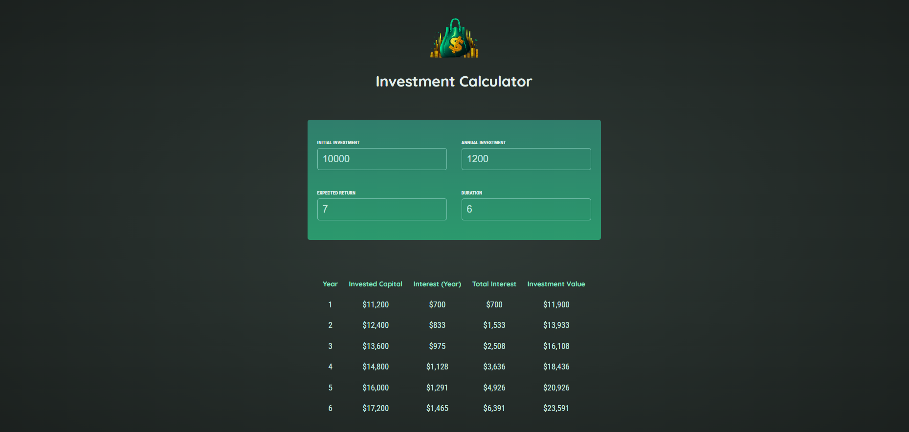

<h1 align="center">React Investment Calculator</h1>
<p align="center">
    
 </p>

<p align="left">
  Take control of your financial future with react-investment-calculator - a powerful tool for calculating potential investment returns. 
  Built with React, this easy-to-use calculator can help you make informed investment decisions and track your progress towards your financial goals. 
</p>

## 🛠️ Technologies:

- React
- JavaScript
- CSS3
- HTML5
- Vite

<h2>🚀 Live Demo</h2>

<p>Check out the React Investment Calculator demo for an intuitive and eye-catching way to calculate your potential investment returns. Start making informed financial decisions today!</p>

**Live Preview** ➡️ <a href="https://srichandan-09.github.io/investment-calculator/" target="_blank" rel="noopener noreferrer">Demo</a>

<h2>🖼️ Project Screenshot</h2>

<p>Get a glimpse of the React Investment Calculator project through these captivating screenshot, showcasing its sleek and user-friendly interface.</p>

<p align="center">
  
</p>

---

# ✨ How to Get Started

## Clone Project:

```bash

git clone https://github.com/Srichandan-09/investment-calculator.git

```

## Install the Dependencies:

```bash

npm install

```

or in short

```bash

npm i

```

## Launch:

```bash

npm run dev

```

## Author

<b>👤 Srichandan</b>

- LinkedIn - [@Srichandan](https://www.linkedin.com/in/srichandan09)
- Github: [@Srichandan-09](https://github.com/Srichandan-09)

Feel free to contact me with any questions or feedback!

## Show your support

Give a ⭐️ if you liked this project!
